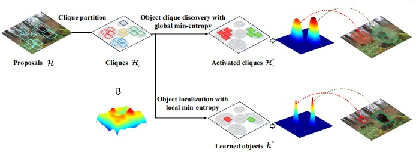
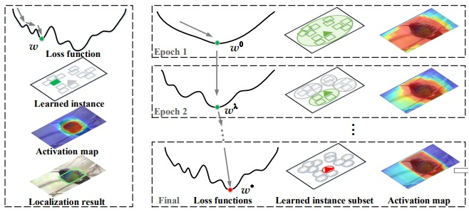
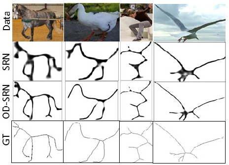
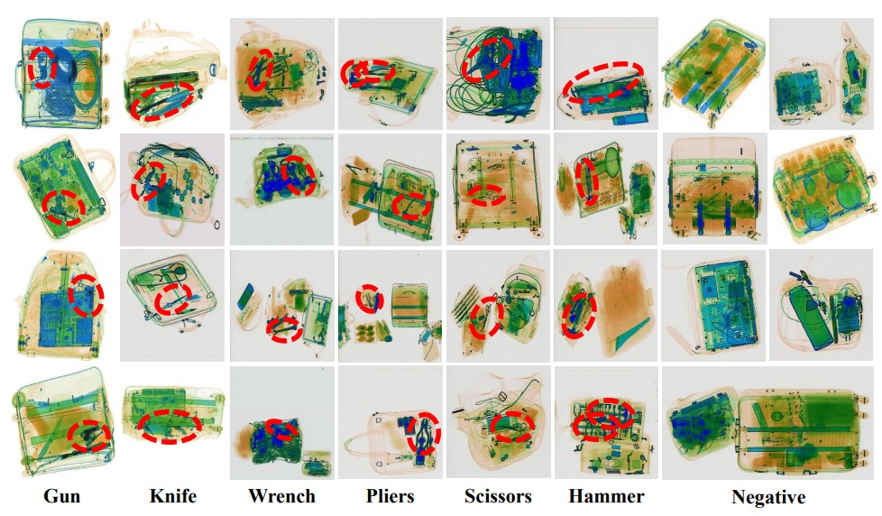
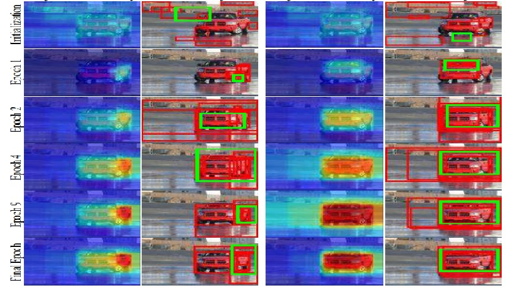
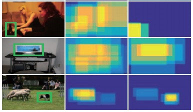

<!DOCTYPE html>

<HTML>
<HEAD>
  <META content="IE=5.0000" http-equiv="X-UA-Compatible">
  <META name="description" content="Fang Wan's home page"> 
  <META http-equiv="Content-Type" content="text/html; charset=gb2312">
  <LINK href="WanFang_files/wfdoc.css" 
    rel="stylesheet" type="text/css"> 
  <TITLE>Fang Wan</TITLE> 
  <META name="GENERATOR" content="MSHTML 11.00.10570.1001">
</HEAD>

<BODY> 
  

  <TABLE>
    <TBODY>
    <TR>
      <TD width="670">
        

        <H1>Fang Wan &nbsp;</H1>

        <H3>Ph.D. Candidate</H3>
        
Room 330, A2 Building 
         School of Electronic, Electrical and Communication Engineering
         University of Chinese Academy of Sciences
         Beijing, China, 101408.
         
          Email:  
        <A href="mailto:wanfang13@mails.ucas.ac.cn"> wanfang13@mails.ucas.ac.cn</A>; 
          Github: 
        <A href="https://github.com/Winfrand/">https://github.com/Winfrand/</A> 
          

      </TD>
      <TD>
        
      </TD>
    </TR>
    <TR></TR></TBODY>
  </TABLE>
  

  <H2>Biography</H2>
  
 I am a third-year Ph.D. student of <A href="https://ucassdl.cn/l">PRISDL</A> in the <A href="http://eece.ucas.ac.cn/index.php/en/">School of Electronic, Electrical and Communication Engineering</A>, <A href="http://english.ucas.ac.cn/">University of Chinese Academy of Sciences </A>, advised by <A href="http://people.ucas.ac.cn/~0007279?language=en">Prof. Qixiang Ye</A>.     
  

  
My research interests include computer vision and machine learning, specifically for weakly supervised learning, feature learning, and visual object detection.

<H2>News</H2>
<UL>
  <LI>
    A simplified version of MELM with context in PyTorch is released <A href="https://github.com/vasgaowei/pytorch_MELM">[here]</A>.
  </LI>
  <LI>
    The slides of "Weakly Supervised Object Detection Localization and Instance Segmentation" in the report of VLASE 2019-02-27 is avalable at <A href="https://github.com/Winfrand/Winfrand.github.io/raw/master/Weakly%20Supervised%20DLIS-TalkVersion.pdf">[WS-DLIS.pdf]</A>
  </LI>
  
  <LI>
    Our paper "Min-Entropy Latent Model for Weakly Supervised Object Detection" has been accepted by IEEE TPAMI 2019. 
  </LI>

  <LI>
    Three of our papers have been accepted by CVPR 2019.
  </LI>

  <LI> The code for our CVPR 2018 paper <A href="https://ucassdl.cn/downloads/publication/CVPR2018_WanFang.pdf">"Min-Entropy Latent Model for Weakly Supervised Object Detection"</A> is available at <A href="https://github.com/Winfrand/MELM">"https://github.com/Winfrand/MELM"</A>.      
  </LI>
</UL>

<H2>Publications</H2>

<table class="pub_table">
  <tbody>

  <!-- #1 -->
  <tr>
    <td class="pub_td1"></td>
    <td 
      class="pub_td2"><u>Fang Wan</u>, Pengxu Wei, Jianbin Jiao, Zhenjun Han and Qixiang Ye
       <b>Min-Entropy Latent Model for Weakly Supervised Object Detection</b>
       IEEE Transactions on Pattern Analysis and Machine Intelligence (TPAMI), 2019
       
      [<a href="https://arxiv.org/pdf/1902.06057.pdf">PDF</a>]
      [<a href="https://github.com/Winfrand/MELM">Code</a>]
    </td>
  </tr>

  <!-- #2 -->
  <tr>
    <td class="pub_td1"></td>
    <td 
      class="pub_td2"><u>Fang Wan</u>, Chang Liu, Wei Ke, Xiangyang Ji, Jianbin Jiao and Qixiang Ye
       <b>C-MIL: Continuation Multiple Instance Learning for Weakly Supervised Object Detection (Oral)</b>
       IEEE Conference on Computer Vision and Pattern Recognition (CVPR), Long Beach, USA, 2019
       
      [<a href="https://arxiv.org/abs/1904.05647">PDF</a>]
      [<a href="https://github.com/Winfrand/C-MIL">Code</a>]
    </td>
  </tr>

  <!-- #3 -->
  <tr>
    <td class="pub_td1"></td>
    <td 
      class="pub_td2">Chang Liu, <u>Fang Wan</u>, Wei Ke, Zhuowei Xiao, Yuan Yao, Xiaosong Zhang, Qixiang Ye
       <b>Orthogonal Decomposition Network for Pixel-wise Binary Classification</b>
       IEEE Conference on Computer Vision and Pattern Recognition (CVPR), Long Beach, USA, 2019
       
      <!-- [<a href="https://arxiv.org/pdf/1901.00303.pdf">PDF</a>] -->
      [<a href="https://github.com/CV-PR/ODN">Code</a>]
    </td>
  </tr>

  <!-- #4 -->
  <tr>
    <td class="pub_td1"></td>
    <td 
      class="pub_td2">Caijing Miao, Lingxi Xie, <u>Fang Wan</u>, Chi Su, Hongye Liu, Jianbin Jiao, Qixiang Ye
       <b>SIXray: A Large-scale Security Inspection X-ray Benchmark for Prohibited Item Discovery in Overlapping Images</b>
       IEEE Conference on Computer Vision and Pattern Recognition (CVPR), Long Beach, USA, 2019
       
      [<a href="https://arxiv.org/pdf/1901.00303.pdf">PDF</a>]
      [<a href="https://github.com/MeioJane/CHR">Code</a>]
      [<a href="https://github.com/MeioJane/SIXray">Dataset</a>]
    </td>
  </tr>

  <!-- #5 -->
  <tr>
    <td class="pub_td1"></td>
    <td 
      class="pub_td2"><u>Fang Wan</u>, Pengxu Wei, Jianbin Jiao, Zhenjun Han and Qixiang Ye
       <b>Min-Entropy Latent Model for Weakly Supervised Object Detection</b>
       IEEE Conference on Computer Vision and Pattern Recognition (CVPR), Salt Lake City, USA, 2018
       
      [<a href="http://openaccess.thecvf.com/content_cvpr_2018/papers/Wan_Min-Entropy_Latent_Model_CVPR_2018_paper.pdf">PDF</a>]
      [<a href="https://github.com/Winfrand/MELM">Code</a>]
    </td>
  </tr>

  <!-- #6 -->
  <tr>
    <td class="pub_td1"></td>
    <td 
      class="pub_td2"> Pengxu Wei, Fei Qin, <u>Fang Wan</u>, Yi Zhu, Jianbin Jiao, Qixiang Ye
       <b>Correlated Topic Vector for Scene Classification</b>
       IEEE Transactions on Image Processing (TIP), 2017
       
      [<a href="https://ucassdl.cn/downloads/publication/TIP2017_WeiPengXu.pdf">PDF</a>]
    </td>
  </tr>

  <!-- #7 -->
  <tr>
    <td class="pub_td1"></td>
    <td 
      class="pub_td2"> Wei Ke, Tianliang Zhang, Jie Chen, <u>Fang Wan</u>, Qixiang Ye, Zhenjun Han
       <b>Texture Complexity based Redundant Regions Ranking for Object Proposal</b>
       IEEE Conference on Computer Vision and Pattern Recognition (CVPR) Workshop, Las Vegas, USA, 2016
       
      [<a href="https://ucassdl.cn/downloads/publication/CVPR2016_KeWei.pdf">PDF</a>]
    </td>
  </tr>

  <!-- #8 -->
  <tr>
    <td class="pub_td1"></td>
    <td 
      class="pub_td2"> <u>Fang Wan</u>, Pengxu Wei, Zhenjun Han, Kun Fu, Qixiang Ye
       <b>Weakly supervised object detection with correlation and part suppression</b>
       IEEE International Conference on Image Processing (ICIP), 2016
       
      [<a href="https://ucassdl.cn/downloads/publication/ICIP2016_WanFang.pdf">PDF</a>]
    </td>
  </tr>

  </tbody>
</table>

    
<H2>Statistics</H2>

</BODY>
</HTML>
